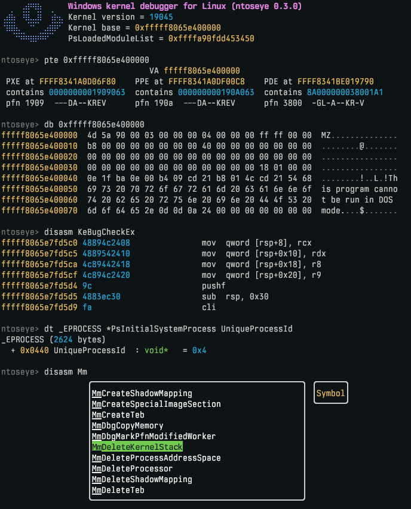

# ntoseye 

Windows kernel debugger for Linux hosts running Windows under KVM/QEMU. Essentially, WinDbg for Linux.

## Features

- Command line interface
- WinDbg style commands
- Kernel debugging
- PDB fetching & parsing for offsets
- Breakpointing

### Supported Windows

`ntoseye` currently only supports Windows 10 and 11 guests.

### Disclaimer

`ntoseye` needs to download symbols to initialize required offsets, it will only download symbols from Microsoft's official symbol server. All files which will be read/written to will be located in `$XDG_CONFIG_HOME/ntoseye`.

### Preview



# Getting started

## Install via cargo

```bash
cargo install ntoseye
```

## Building

```bash
git clone https://github.com/dmaivel/ntoseye.git
cd ntoseye
cargo build --release
```

# Usage

It is recommended that you run the following command before running `ntoseye` or a VM:
```bash
echo 0 | sudo tee /proc/sys/kernel/yama/ptrace_scope
```

Note that you may need to run `ntoseye` with `sudo` aswell (last resort, try command above first).

To view command line arguments, run `ntoseye --help`. The debugger is self documented, so pressing tab will display completions and descriptions for commands, symbols, and types.

## VM configuration

`bcdedit /debug on` is not required within the guest.

Many features depend on `gdbstub` being enabled, so its recommended that it is enabled.

It is recommended to disable memory paging and memory compression within the guest operating system to avoid memory-related issues. This only needs to be done once per Windows installation. Run the following commands in PowerShell (Run as Administrator):
```
Get-CimInstance Win32_ComputerSystem | Set-CimInstance -Property @{ AutomaticManagedPagefile = $false }
Get-CimInstance Win32_PageFileSetting | Remove-CimInstance
Disable-MMAgent -MemoryCompression
Restart-Computer
```

#### QEMU

Append `-s -S` to qemu command.

#### virt-manager

Add the following to the XML configuration:
```xml
<domain xmlns:qemu="http://libvirt.org/schemas/domain/qemu/1.0" type="kvm">
  ...
  <qemu:commandline>
    <qemu:arg value="-s"/>
    <qemu:arg value="-S"/>
  </qemu:commandline>
</domain>
```

## Credits

Functionality regarding initialization of guest information was written with the help of the following sources:

- [vmread](https://github.com/h33p/vmread)
- [pcileech](https://github.com/ufrisk/pcileech)
- [MemProcFS](https://github.com/ufrisk/MemProcFS)
